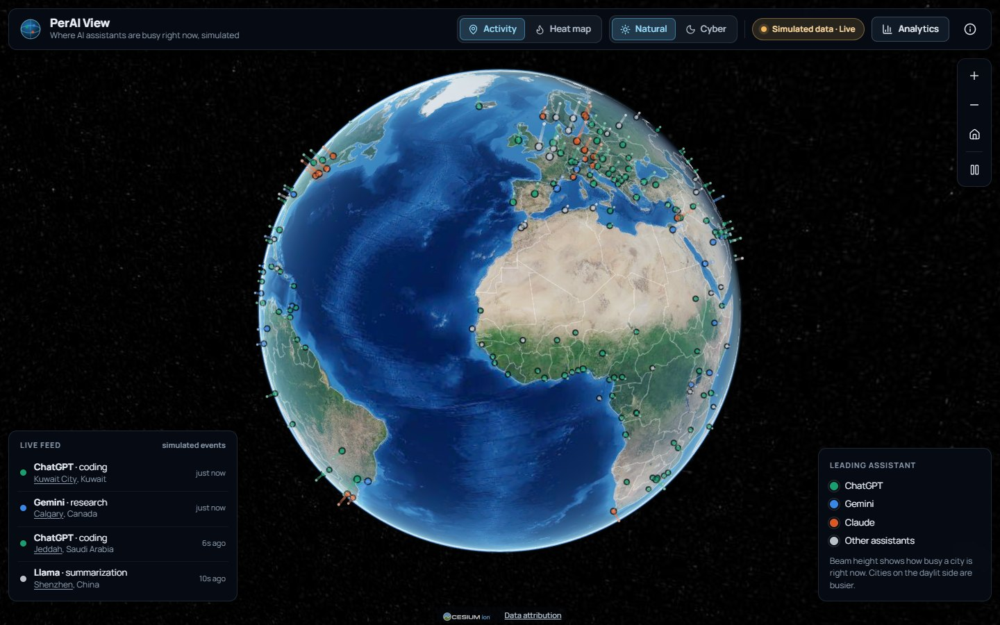
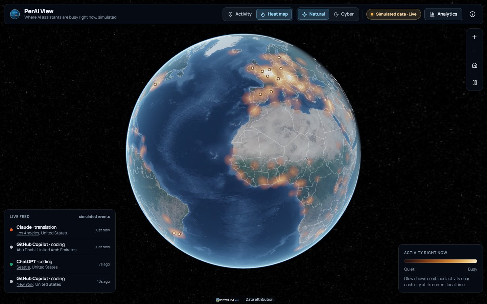
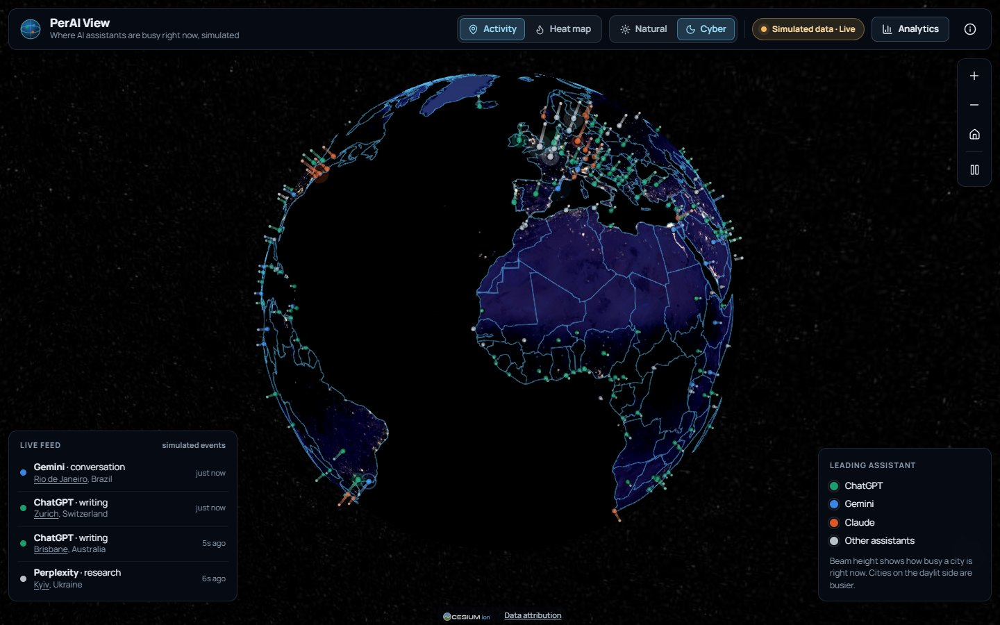
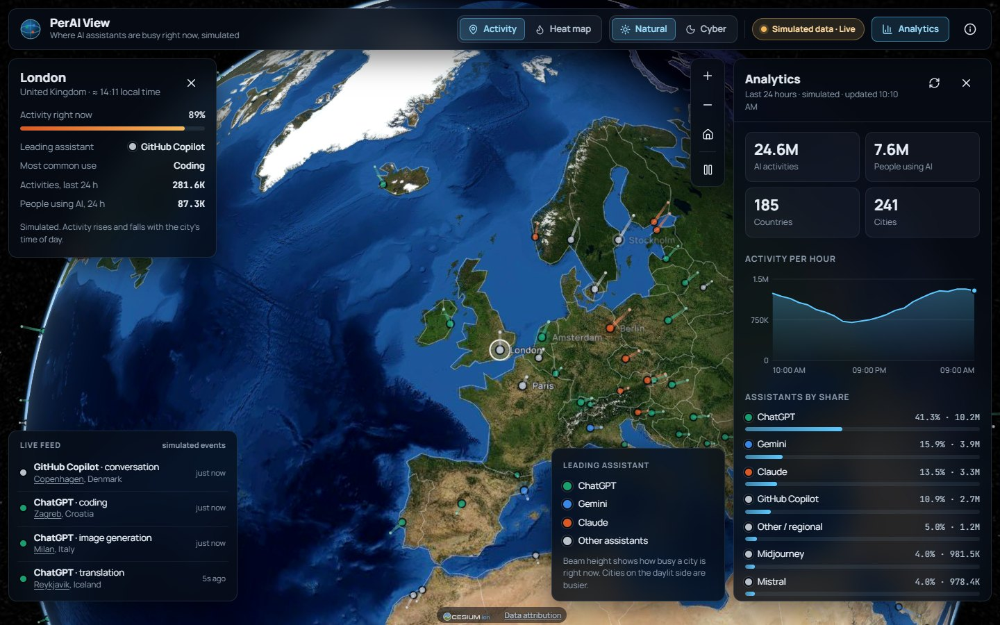
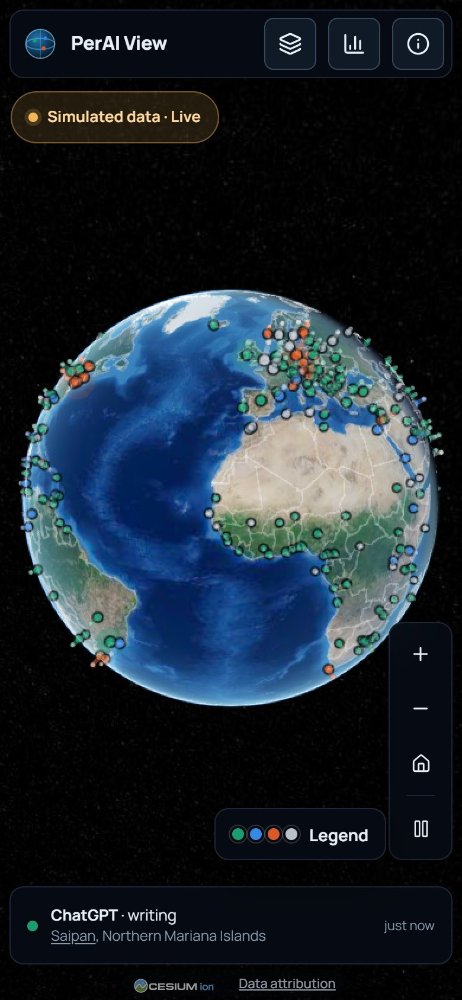
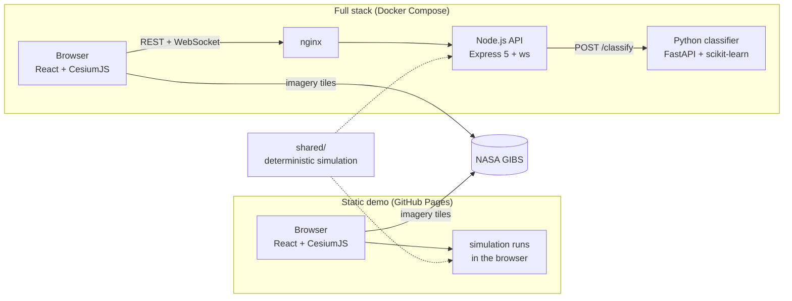

# PerAI View

An interactive 3D globe that shows where people use AI assistants, what they use them for, and
how that activity follows the sun around the planet.

> **All data is simulated.** Nothing is collected from or about real users. Every number comes
> from a deterministic model of 241 cities, and the app says so on screen.

**Live demo:** https://bisratasfaw.github.io/Portfolio-HTML-CSS-1/perai-view/
(published from the portfolio site, which builds this repository's `main` branch; the
[Pages workflow](.github/workflows/deploy-pages.yml) here can also publish it standalone)

[](https://github.com/bisratasfaw/perai-view/actions/workflows/ci.yml)
[](LICENSE)



## Features

- **3D globe** built on CesiumJS with NASA Blue Marble daytime imagery, VIIRS night lights along
  the real day/night line, and country borders. Drag, zoom, or let it rotate.
- **Two map layers.** *Activity* draws a beam per city whose height is how busy it is right now and
  whose colour is its leading assistant. *Heat map* draws a continuous glow of current activity.
- **Two styles.** *Natural* (sunlit Earth) and *Cyber* (night lights only).
- **Live feed.** A new simulated event every few seconds, listed in the corner and flashed on the
  globe in the assistant's colour.
- **City details.** Select a city on the globe, in the feed or in the rankings to fly there and see
  its local time, current activity, leading assistant, most common use and 24-hour totals.
- **Analytics panel.** 24-hour totals, an hourly activity chart, assistants by share, the ten
  busiest cities and what people use AI for.
- **Shareable views.** Layer, style and city live in the URL, for example
  `?layer=heat&theme=cyber&city=Tokyo`.
- **Phone layout.** Compact top bar with a layers menu, collapsible legend and analytics as a
  bottom sheet.
- **Activity classifier.** Type a prompt in the About dialog to see which of seven activity types it
  is, with confidence scores. With the full stack it uses the scikit-learn model through the API; the
  static demo uses a keyword classifier in the browser. The result says which one answered.
- **Accessibility.** Keyboard operable, labelled controls, a text alternative for the chart,
  `prefers-reduced-motion` and `forced-colors` support, checked with axe in end-to-end tests.
- **Two ways to run.** As a static site with the simulation in the browser (free hosting), or as a
  full stack with a Node.js API, a WebSocket feed and a Python machine-learning classifier.

| Heat map | Cyber style |
| --- | --- |
|  |  |
| **Analytics panel** | **Phone** |
|  |  |

## How it works



1. **The simulation** (`shared/`) gives each of 241 cities an illustrative weight and a leading
   assistant. A city's activity follows a daily curve on its local solar time, so the sunlit half
   of the planet is always busiest. Aggregates are pure functions of the current time; live events
   are drawn at random from cities weighted by how busy they are.
2. **The frontend** reads data through one `DataSource` interface. The static build runs the
   simulation in the browser; the Docker build calls the API and subscribes to its WebSocket.
3. **The globe engine** is plain TypeScript around CesiumJS, driven by React state but rendering
   independently of React, with frames drawn only while something moves.
4. **The API** exposes the same simulation over REST and WebSocket, plus the classification
   endpoint behind the About dialog's classifier box, backed by the Python model with a keyword
   fallback when the model service is down.

More detail: [Architecture](docs/ARCHITECTURE.md) · [API reference](docs/API.md)

## Tech stack

| Area | Technologies |
| --- | --- |
| Frontend | React 18, TypeScript (strict), Vite 7, CesiumJS 1.145, Zustand, lucide-react |
| Maps and imagery | NASA GIBS (Blue Marble, VIIRS Black Marble), Natural Earth via world-atlas, topojson-client |
| Backend | Node.js 22, Express 5, ws, zod, helmet, express-rate-limit, esbuild |
| Machine learning | Python 3.12, FastAPI, scikit-learn, NumPy, pydantic |
| Testing | Vitest, Testing Library, supertest, Playwright, axe-core, pytest |
| Tooling | ESLint, ruff, pip-audit, Docker, nginx, GitHub Actions, Dependabot |

## Quick start

Requirements: Node.js 22 (20.19+ works) and a browser with WebGL. Python 3.11-3.13 and Docker are
optional. See the [development guide](docs/DEVELOPMENT.md) for details and troubleshooting.

```bash
git clone https://github.com/bisratasfaw/perai-view.git
cd perai-view
```

**Static demo** (no backend; the simulation runs in the browser):

```bash
npm ci --prefix frontend && npm run dev:web
```

Open http://localhost:5173. Vite logs a proxy error while it checks for a local API; that is
expected.

**Full stack with npm** (API with WebSocket feed on :4000, web app on :5173):

```bash
npm install && npm run setup
npm run dev
```

Add the machine-learning classifier on :8000 with `npm run classifier:setup` once, then use
`npm run dev:all` instead of `npm run dev`.

**Full stack with Docker Compose** (web app, API and classifier behind nginx):

```bash
docker compose up --build
```

Open http://localhost:8080.

## Project structure

```
perai-view/
├── shared/                   Simulation, city and assistant registries, keyword classifier, tests
├── frontend/
│   ├── src/
│   │   ├── components/       Top bar, analytics panel, trend chart, city card, legend, live feed, About
│   │   ├── globe/            GlobeEngine (CesiumJS layers), heat-map canvas, colour helpers
│   │   ├── data/             DataSource: in-browser simulation or API + WebSocket
│   │   ├── store.ts          Zustand state and URL deep links
│   │   └── App.tsx
│   ├── e2e/                  Playwright tests (desktop and phone)
│   ├── Dockerfile            Vite build served by nginx
│   └── nginx.conf            Caching, security headers, /api and WebSocket proxy
├── backend/
│   ├── src/                  app, config, routes/, services/, realtime/, middleware/
│   ├── test/                 Vitest + supertest
│   └── Dockerfile
├── ai-classifier/
│   ├── app/                  FastAPI app, model, schemas, training data
│   ├── tests/                pytest
│   └── Dockerfile
├── docs/                     Architecture, API, development and deployment guides, screenshots
├── scripts/classifier.mjs    Cross-platform helper behind the classifier:* npm scripts
├── .github/                  CI and Pages workflows, Dependabot, issue and PR templates
├── docker-compose.yml
└── package.json              Root scripts that orchestrate the packages
```

## Testing

| Suite | Tests | Command | What it covers |
| --- | --- | --- | --- |
| Backend | 110 | `npm test --prefix backend` | Every endpoint, validation and error format, body limits, security headers, CORS, rate limits, the WebSocket protocol (replay, ping/pong, origin check, global and per-IP client caps, heartbeat, shutdown), config parsing, classifier fallback |
| Frontend and shared | 39 | `npm test --prefix frontend` | Simulation invariants and determinism, registries, keyword classifier, in-browser data source, colour and heat-ramp helpers, formatting, URL state, components |
| End-to-end | 11 | `npm run test:e2e` | Chromium against a production build: globe and imagery load without console errors, layers and styles, deep links, analytics and city details, keyboard controls, axe scan, reduced motion, classifier box, phone layout and touch-target sizes |
| Classifier | 68 | `npm run classifier:test` | API shapes and limits, batch ordering, CORS, cross-validated accuracy floor, determinism, unseen prompts per label, training-data checks |

Test counts are a snapshot at the time of writing; each command prints the current number.
`npm run check` runs lint, type checks and the unit tests for the frontend and backend.
[CI](.github/workflows/ci.yml) runs all four suites, `ruff`, `pip-audit`, and builds and
smoke-tests the Docker Compose stack on every push and pull request.

## Engineering decisions

- **One simulation, two runtimes.** The same TypeScript module powers the API and the static
  demo. Aggregates depend only on the timestamp, so both return the same numbers for the same
  instant, the free static demo stays faithful to the full stack, and the model is easy to test.
- **Honest by design.** The UI labels data as simulated in the top bar, panels and About dialog,
  API responses include `"simulated": true`, and classifier responses say whether the model or the
  keyword fallback answered.
- **$0 to run publicly.** The demo is a static site on GitHub Pages. Earth imagery comes from NASA
  GIBS, which is public domain and needs no API key.
- **A read-only, hardened API.** zod validation on every input, body and prompt size limits,
  per-IP rate limits, one origin allow-list shared by CORS and the WebSocket handshake, WebSocket
  frame, client and backpressure limits, helmet headers, no stack traces in production, and
  graceful shutdown.
- **Rendering outside React.** A small imperative engine owns CesiumJS; React only sends it
  state. Cesium's request-render mode draws frames only while something animates.
- **Colour that survives colour blindness.** Nine assistants cannot get nine distinguishable map
  colours, so only ChatGPT, Gemini and Claude get a hue and the rest share a neutral grey. The four
  colours were validated together in OKLab: every pair stays at least 9.4 ΔE (×100) apart under
  simulated protanopia and deuteranopia and 20.9 apart for normal vision, and assistant names are
  always available as text.
- **Accessibility and motion.** Reduced-motion users get no auto-rotation, pulses or animated
  flights. Keyboard controls, axe accessibility rules and phone touch-target sizes are checked by
  end-to-end tests.
- **A small model with honest evaluation.** The classifier trains at startup on 350 synthetic
  prompts, reports 5-fold cross-validated accuracy (about 0.85) and documents its
  [limitations](ai-classifier/README.md#limitations-honest-ones).
- **A tested security policy.** The nginx Content Security Policy was checked against a production
  build in Chromium; CesiumJS needs `'unsafe-eval'` and `blob:` workers, and the config explains
  why.

## Roadmap

- Local time zones and daylight saving instead of solar time from longitude.
- Better separation between the ChatGPT and Gemini colours for tritanopia.
- Unit tests for the globe engine (today it is covered by end-to-end tests only).
- Lighter initial download by loading CesiumJS modules on demand.

## Contributing

Contributions are welcome. See [CONTRIBUTING.md](CONTRIBUTING.md), the
[code of conduct](CODE_OF_CONDUCT.md) and the [security policy](SECURITY.md).

## Credits

- Imagery: NASA [Global Imagery Browse Services (GIBS)](https://nasa-gibs.github.io/gibs-api-docs/),
  Blue Marble and VIIRS Black Marble. We acknowledge the use of imagery provided by services from
  NASA's Global Imagery Browse Services (GIBS), part of NASA's Earth Science Data and Information
  System (ESDIS).
- Country borders: [Natural Earth](https://www.naturalearthdata.com/) (public domain) via
  [world-atlas](https://github.com/topojson/world-atlas) and topojson-client.
- Globe engine: [CesiumJS](https://cesium.com/platform/cesiumjs/) (Apache 2.0).
- Fonts: Manrope and JetBrains Mono via [Fontsource](https://fontsource.org/) (SIL Open Font
  License). Icons: [Lucide](https://lucide.dev/) (ISC).

## License

[MIT](LICENSE) © 2026 Bisrat Serur
