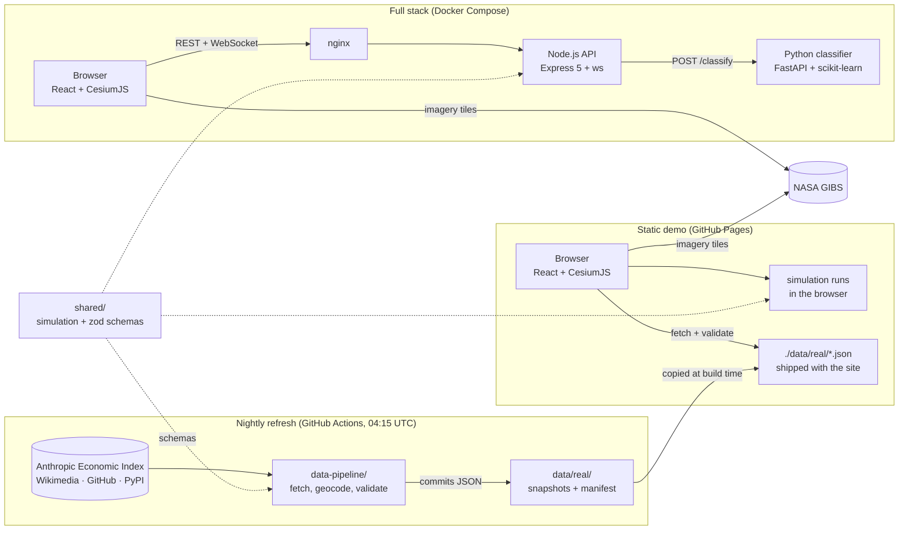
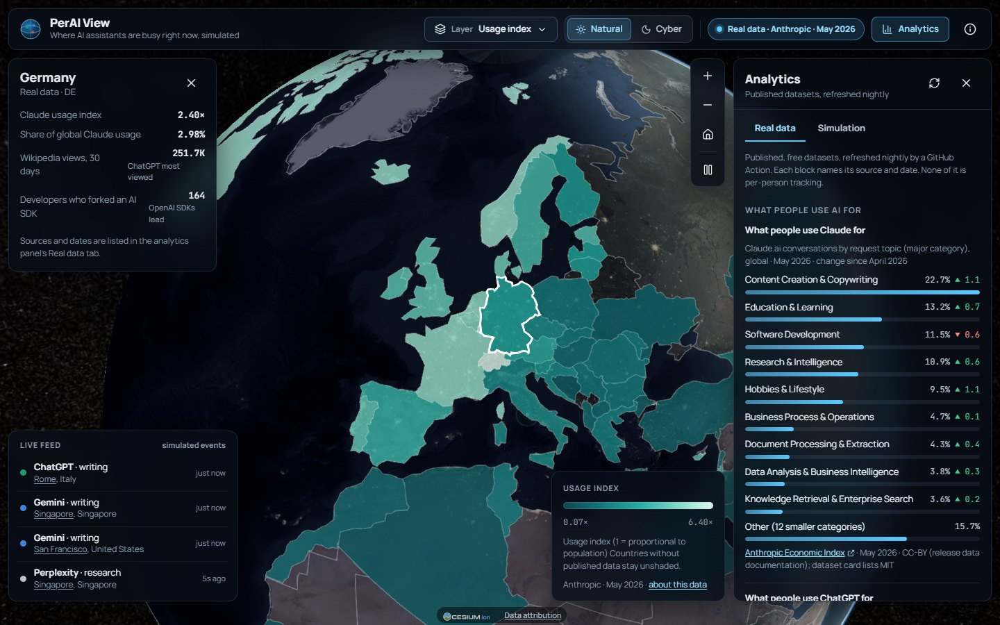

# PerAI View

An interactive 3D globe of AI-assistant use: where people use assistants, what they use them for,
and how that activity follows the sun around the planet. It shows two kinds of data side by side,
always labelled: a deterministic **simulation** of live activity, and **real published datasets**
(Anthropic Economic Index, Wikimedia, GitHub, optionally PyPI) refreshed every night.

> **Two kinds of data, never mixed.** The live feed, the *Activity* and *Heat map* layers and the
> *Simulation* analytics tab come from a deterministic model of 241 cities; nothing is collected
> from or about real users. The *Real data* layers, the *Real data* analytics tab and the country
> card show third-party published datasets, and every number carries its source and date on
> screen.

**Live demo:** https://bisratasfaw.github.io/Portfolio-HTML-CSS-1/perai-view/
(published from the portfolio site, which builds this repository's `main` branch; the
[Pages workflow](.github/workflows/deploy-pages.yml) here can also publish it standalone)

[](https://github.com/bisratasfaw/perai-view/actions/workflows/ci.yml)
[](LICENSE)


## Features

- **3D globe** built on CesiumJS with NASA Blue Marble daytime imagery, VIIRS night lights along
  the real day/night line, and country borders. Drag, zoom, or let it rotate.
- **Two simulated layers.** *Activity* draws a beam per city whose height is how busy it is right
  now and whose colour is its leading assistant. *Heat map* draws a continuous glow of current
  activity.
- **Four real-data layers**, each labelled with its publisher and date in the top bar and legend:
  *Claude usage by country* (Anthropic Economic Index), *Wikipedia interest by country*
  (Wikimedia pageviews), *Developers by city* (GitHub SDK forks) and *SDK downloads by country*
  (PyPI, optional). Country layers are choropleths; the developers layer is city points.
- **Real data tab** in the analytics panel: what people use ChatGPT and Claude for, a 30-day
  Wikipedia interest chart, and rankings by country and city that fly the globe there.
- **Country card.** Select a country on a choropleth to see every published figure that covers
  it: usage index, share of Claude usage, Wikipedia views, SDK downloads and developer count.
- **Data sources in the About dialog**, straight from the pipeline's manifest: title, publisher,
  licence, "as of" date and status for every source.
- **Two styles.** *Natural* (sunlit Earth) and *Cyber* (night lights only).
- **Live feed.** A new simulated event every few seconds, listed in the corner and flashed on the
  globe in the assistant's colour.
- **City details.** Select a city on the globe, in the feed or in the rankings to fly there and see
  its local time, current activity, leading assistant, most common use and 24-hour totals.
- **Analytics panel.** 24-hour totals, an hourly activity chart, assistants by share, the ten
  busiest cities and what people use AI for (simulation), next to the real-data tab.
- **Shareable views.** Layer, style and selection live in the URL, for example
  `?layer=heat&theme=cyber&city=Tokyo` or `?layer=usage-index&country=DE`.
- **Phone layout.** Compact top bar with a layers menu, collapsible legend and analytics as a
  bottom sheet.
- **Activity classifier.** Type a prompt in the About dialog to see which of seven activity types it
  is, with confidence scores. With the full stack it uses the scikit-learn model through the API; the
  static demo uses a keyword classifier in the browser. The result says which one answered.
- **Accessibility.** Keyboard operable, labelled controls, a text alternative for the charts,
  `prefers-reduced-motion` and `forced-colors` support, checked with axe in end-to-end tests.
- **Two ways to run.** As a static site with the simulation in the browser (free hosting), or as a
  full stack with a Node.js API, a WebSocket feed and a Python machine-learning classifier. The
  real-data snapshots ship with both.

| Heat map | Cyber style |
| --- | --- |
|  |  |
| **Analytics panel** | **Phone** |
|  |  |

## How it works



1. **The simulation** (`shared/`) gives each of 241 cities an illustrative weight and a leading
   assistant. A city's activity follows a daily curve on its local solar time, so the sunlit half
   of the planet is always busiest. Aggregates are pure functions of the current time; live events
   are drawn at random from cities weighted by how busy they are.
2. **The data pipeline** (`data-pipeline/`) fetches five free public sources every night, geocodes
   and aggregates them, validates the result against the zod schemas in `shared/realData.ts` and
   commits JSON snapshots plus a manifest to `data/real/`. A failing source keeps its previous
   snapshot and is marked as such.
3. **The frontend** reads simulated data through one `DataSource` interface (in-browser
   simulation or API + WebSocket) and real data by fetching the snapshots from `./data/real/`
   and validating them with the same schemas. A layer registry says which of the two each map
   layer uses, and the UI labels it accordingly.
4. **The globe engine** is plain TypeScript around CesiumJS, driven by React state but rendering
   independently of React, with frames drawn only while something moves. Real country layers are
   choropleths over Natural Earth polygons; real city layers reuse the beam renderer.
5. **The API** exposes the simulation over REST and WebSocket, plus the classification endpoint
   behind the About dialog's classifier box, backed by the Python model with a keyword fallback
   when the model service is down.

More detail: [Architecture](docs/ARCHITECTURE.md) · [API reference](docs/API.md)

## Real data



Five sources, all free and published by third parties. None of them is per-person tracking; the
pipeline stores aggregated counts only. The snapshots live in [`data/real/`](data/real/README.md)
with a `manifest.json` that records, for each source, its status, when it was fetched, how
current it is, its licence and any caveats.

| Source | What | Publisher | Licence | Refresh | Where it appears |
| --- | --- | --- | --- | --- | --- |
| [Anthropic Economic Index](https://huggingface.co/datasets/Anthropic/EconomicIndex) | Claude.ai usage share and per-capita usage index for 121 countries and 52 US states (latest release `release_2026_06_26`, May 2026), plus the global mix of request topics | Anthropic, on Hugging Face | CC-BY per the release documentation (dataset card says MIT) | Nightly check; the 219 MB CSV is streamed only when its object id changes | *Claude usage by country* layer, Real data tab, country card |
| [How People Use ChatGPT](https://www.nber.org/papers/w34255) (NBER WP 34255) | Share of consumer ChatGPT messages by topic, July 2025 versus July 2024: practical guidance 29%, seeking information 24%, writing 24%, multimedia 7%, technical help 5%, remainder 11% | OpenAI / NBER (Chatterji et al.) | Figures quoted from the paper; no dataset exists | Static transcription | Real data tab |
| [Wikimedia pageviews](https://wikitech.wikimedia.org/wiki/Analytics/AQS/Pageviews) | Daily human views of 8 assistants' Wikipedia articles across 436 language editions for the last 30 days, plus per-country sums from the differentially private `country_project_page` dataset (a lower bound, about 75 countries) | Wikimedia Foundation | CC0 | Nightly; only new days are downloaded | *Wikipedia interest by country* layer, Real data tab chart and ranking, country card |
| [GitHub SDK forks](https://docs.github.com/en/graphql) | Self-reported locations of people who forked 8 official SDK repositories (OpenAI, Anthropic, Google Gemini, Mistral, Meta Llama; newest 6,000 forks per repository), geocoded offline: 42% of locations matched one of the globe's cities, 88% a country; 159 cities | GitHub GraphQL API | Public profile data via the API; only aggregated counts are stored | Nightly | *Developers by city* layer, Real data tab, country card |
| [PyPI downloads](https://console.cloud.google.com/marketplace/product/gcp-public-data-pypi/pypi) | Downloads of the `openai`, `anthropic`, `google-genai` and `mistralai` packages by country over the last 7 days, from `bigquery-public-data.pypi.file_downloads` | Python Software Foundation via Google BigQuery | PyPI public dataset | Weekly (Mondays) or on demand; **optional**, `not_configured` until the BigQuery secrets exist | *SDK downloads by country* layer, Real data tab, country card |

**How the nightly refresh works.** The
[`refresh-data` workflow](.github/workflows/refresh-data.yml) runs at 04:15 UTC, restores the
pipeline's cache (Hugging Face object ids, per-day Wikipedia country sums) from the Actions cache,
runs `npm run refresh` in `data-pipeline/`, validates every file with `npm run validate` and
commits `data/real/**` as `github-actions[bot]` when anything changed. Sources run independently:
one failing does not stop the others, and the manifest marks it `failed` (previous file kept) or
`stale` (older than its cadence allows). The portfolio site rebuilds from `main` on its own
schedule, so the live demo picks the new snapshots up at its next deploy. Locally:

```bash
npm run data:refresh -- --only wikipedia,github   # a subset (needs GITHUB_TOKEN for github)
npm run data:refresh -- --force                   # ignore caches and re-download everything
npm run data:validate                             # parse every snapshot against the schemas
```

**Enabling PyPI downloads (5 minutes, free).** BigQuery's public PyPI dataset needs a Google
Cloud project, but no billing account: (1) create a project, (2) open BigQuery and accept the
free sandbox (1 TB of queries per month), (3) create a service account with the *BigQuery Job
User* role and download a JSON key, (4) add the repository secrets `BIGQUERY_PROJECT` (the project
id) and `GCP_SERVICE_ACCOUNT_KEY` (the key file's contents), (5) run the workflow with
`force_pypi` ticked. The query scans tens of GB, so the workflow only runs it on Mondays or when
forced. Details: [`data/real/README.md`](data/real/README.md).

## Tech stack

| Area | Technologies |
| --- | --- |
| Frontend | React 18, TypeScript (strict), Vite 7, CesiumJS 1.145, Zustand, zod, lucide-react |
| Maps and imagery | NASA GIBS (Blue Marble, VIIRS Black Marble), Natural Earth via world-atlas, topojson-client |
| Data pipeline | Node.js 22, TypeScript, tsx, zod, google-auth-library, world-countries; GitHub Actions cron |
| Real data sources | Anthropic Economic Index (Hugging Face), Wikimedia Pageviews API and `country_project_page`, GitHub GraphQL API, PyPI via BigQuery |
| Backend | Node.js 22, Express 5, ws, zod, helmet, express-rate-limit, esbuild |
| Machine learning | Python 3.12, FastAPI, scikit-learn, NumPy, pydantic |
| Testing | Vitest, Testing Library, supertest, Playwright, axe-core, pytest |
| Tooling | ESLint, ruff, pip-audit, Docker, nginx, GitHub Actions, Dependabot |

## Quick start

Requirements: Node.js 22 (20.19+ works) and a browser with WebGL. Python 3.11-3.13 and Docker are
optional. See the [development guide](docs/DEVELOPMENT.md) for details and troubleshooting.

```bash
git clone https://github.com/bisratasfaw/perai-view.git
cd perai-view
```

**Static demo** (no backend; the simulation runs in the browser, the committed real-data
snapshots are served from `data/real/`):

```bash
npm ci --prefix frontend && npm run dev:web
```

Open http://localhost:5173. Vite logs a proxy error while it checks for a local API; that is
expected.

**Full stack with npm** (API with WebSocket feed on :4000, web app on :5173):

```bash
npm install && npm run setup
npm run dev
```

Add the machine-learning classifier on :8000 with `npm run classifier:setup` once, then use
`npm run dev:all` instead of `npm run dev`.

**Full stack with Docker Compose** (web app, API and classifier behind nginx):

```bash
docker compose up --build
```

Open http://localhost:8080.

**Refreshing the real data** is optional (the repository already contains snapshots):
`npm ci --prefix data-pipeline`, then `npm run data:refresh`. See [Real data](#real-data).

## Project structure

```
perai-view/
├── shared/                   Simulation, city and assistant registries, keyword classifier,
│                             realData.ts (zod schemas shared by the pipeline and the UI), tests
├── data/real/                Committed real-data snapshots, manifest.json and README (written by the pipeline)
├── data-pipeline/
│   ├── src/refresh.ts        CLI: --only, --skip, --force, --data-dir
│   ├── src/validate.ts       Parses every snapshot against the shared schemas
│   ├── src/sources/          One fetcher per source: anthropic, openai, wikipedia, pypi, github, countries
│   ├── src/lib/              HTTP with retries, streaming CSV, offline geocoder, state cache, logging
│   └── test/                 Vitest with recorded fixtures (no network)
├── frontend/
│   ├── src/
│   │   ├── components/       Top bar, layer menu, legend, analytics panel (Simulation and Real data tabs),
│   │   │                     trend and multi-line charts, city card, country card, live feed, About
│   │   ├── globe/            GlobeEngine (CesiumJS layers, choropleths), heat-map canvas, colour helpers
│   │   ├── data/             DataSource (simulation or API + WebSocket), realData.ts loader, per-layer adapters
│   │   ├── layers.ts         Layer registry: id, label, simulated or real, geometry, snapshot and source
│   │   ├── store.ts          Zustand state and URL deep links
│   │   └── App.tsx
│   ├── e2e/                  Playwright tests (desktop, phone, real data)
│   ├── Dockerfile            Vite build served by nginx
│   └── nginx.conf            Caching, security headers, /api and WebSocket proxy
├── backend/
│   ├── src/                  app, config, routes/, services/, realtime/, middleware/
│   ├── test/                 Vitest + supertest
│   └── Dockerfile
├── ai-classifier/
│   ├── app/                  FastAPI app, model, schemas, training data
│   ├── tests/                pytest
│   └── Dockerfile
├── docs/                     Architecture, API, development and deployment guides, screenshots
├── scripts/classifier.mjs    Cross-platform helper behind the classifier:* npm scripts
├── .github/                  CI, nightly data refresh and Pages workflows, Dependabot, issue and PR templates
├── docker-compose.yml
└── package.json              Root scripts that orchestrate the packages
```

## Testing

| Suite | Tests | Command | What it covers |
| --- | --- | --- | --- |
| Backend | 110 | `npm test --prefix backend` | Every endpoint, validation and error format, body limits, security headers, CORS, rate limits, the WebSocket protocol (replay, ping/pong, origin check, global and per-IP client caps, heartbeat, shutdown), config parsing, classifier fallback |
| Frontend and shared | 61 | `npm test --prefix frontend` | Simulation invariants and determinism, registries, keyword classifier, in-browser data source, real-data loader and schema validation, choropleth scaling, colour and heat-ramp helpers, formatting, URL state, components |
| End-to-end | 15 | `npm run test:e2e` | Chromium against a production build: globe and imagery load without console errors, layers and styles, deep links, analytics and city details, keyboard controls, axe scan, reduced motion, classifier box, phone layout and touch-target sizes, real-data layers, country card and provenance labels against the committed snapshots |
| Classifier | 68 | `npm run classifier:test` | API shapes and limits, batch ordering, CORS, cross-validated accuracy floor, determinism, unseen prompts per label, training-data checks |
| Data pipeline | 112 | `npm run data:test` | CSV and TSV parsing from recorded fixtures, the offline geocoder, per-source extraction and aggregation, manifest status rules (`ok`, `stale`, `failed`, `not_configured`), snapshot validation |

Test counts are a snapshot at the time of writing; each command prints the current number.
`npm run check` runs lint, type checks and the unit tests for the frontend and backend.
[CI](.github/workflows/ci.yml) runs all five suites, `ruff`, `pip-audit`, validates the committed
snapshots in `data/real/` against the shared schemas, and builds and smoke-tests the Docker
Compose stack on every push and pull request.

## Engineering decisions

- **One simulation, two runtimes.** The same TypeScript module powers the API and the static
  demo. Aggregates depend only on the timestamp, so both return the same numbers for the same
  instant, the free static demo stays faithful to the full stack, and the model is easy to test.
- **Honest by design.** Simulated and real data are never blended. The top-bar chip, legend,
  panels and About dialog say which one is on screen; real layers name their publisher and date;
  API responses include `"simulated": true`; classifier responses say whether the model or the
  keyword fallback answered.
- **One schema for the pipeline and the UI.** `shared/realData.ts` holds the zod schemas; the
  pipeline refuses to write a snapshot that does not parse, CI re-validates the committed files,
  and the browser validates again before rendering. The two sides cannot drift.
- **Snapshots committed, caches not.** `data/real/` is in git, so every build is reproducible and
  the site works with no runtime dependency on Hugging Face, Wikimedia or GitHub. The pipeline's
  own cache (`.pipeline-state.json`: object ids, per-day sums) lives in the GitHub Actions cache,
  so the nightly run only downloads what changed; the 219 MB Anthropic CSV is streamed line by
  line, once per release.
- **Every number carries provenance.** The manifest records status, fetch time, "as of" date,
  licence and caveats per source, and the UI shows them next to the numbers: a lower bound is
  called a lower bound, a transcription is called a transcription, and a source that fails keeps
  its last good snapshot marked `failed` or `stale` instead of silently disappearing.
- **$0 to run publicly.** The demo is a static site on GitHub Pages. Earth imagery comes from NASA
  GIBS, which is public domain and needs no API key, and every data source is free; the only
  optional secrets are BigQuery sandbox credentials, which also cost nothing.
- **A read-only, hardened API.** zod validation on every input, body and prompt size limits,
  per-IP rate limits, one origin allow-list shared by CORS and the WebSocket handshake, WebSocket
  frame, client and backpressure limits, helmet headers, no stack traces in production, and
  graceful shutdown.
- **Rendering outside React.** A small imperative engine owns CesiumJS; React only sends it
  state. Cesium's request-render mode draws frames only while something animates.
- **Colour that survives colour blindness.** Nine assistants cannot get nine distinguishable map
  colours, so only ChatGPT, Gemini and Claude get a hue and the rest share a neutral grey. The four
  colours were validated together in OKLab: every pair stays at least 9.4 ΔE (×100) apart under
  simulated protanopia and deuteranopia and 20.9 apart for normal vision, and assistant names are
  always available as text. Choropleths use a single-hue teal ramp, distinct from the amber
  simulated heat map, with square-root scaling for skewed counts.
- **Accessibility and motion.** Reduced-motion users get no auto-rotation, pulses or animated
  flights. Keyboard controls, axe accessibility rules and phone touch-target sizes are checked by
  end-to-end tests.
- **A small model with honest evaluation.** The classifier trains at startup on 350 synthetic
  prompts, reports 5-fold cross-validated accuracy (about 0.85) and documents its
  [limitations](ai-classifier/README.md#limitations-honest-ones).
- **A tested security policy.** The nginx Content Security Policy was checked against a production
  build in Chromium; CesiumJS needs `'unsafe-eval'` and `blob:` workers, and the config explains
  why.

## Roadmap

- Local time zones and daylight saving instead of solar time from longitude.
- Better separation between the ChatGPT and Gemini colours for tritanopia.
- Unit tests for the globe engine (today it is covered by end-to-end tests only).
- Lighter initial download by loading CesiumJS modules on demand.
- Turn on the PyPI layer in the public demo once the BigQuery sandbox secrets are added.

## Contributing

Contributions are welcome. See [CONTRIBUTING.md](CONTRIBUTING.md), the
[code of conduct](CODE_OF_CONDUCT.md) and the [security policy](SECURITY.md).

## Credits

- Imagery: NASA [Global Imagery Browse Services (GIBS)](https://nasa-gibs.github.io/gibs-api-docs/),
  Blue Marble and VIIRS Black Marble. We acknowledge the use of imagery provided by services from
  NASA's Global Imagery Browse Services (GIBS), part of NASA's Earth Science Data and Information
  System (ESDIS).
- Country borders: [Natural Earth](https://www.naturalearthdata.com/) (public domain) via
  [world-atlas](https://github.com/topojson/world-atlas) and topojson-client. Country codes and
  centroids: [world-countries](https://github.com/mledoze/countries) (ODbL 1.0).
- Real data: the [Anthropic Economic Index](https://huggingface.co/datasets/Anthropic/EconomicIndex)
  (CC-BY); [Wikimedia Analytics](https://wikitech.wikimedia.org/wiki/Analytics/AQS/Pageviews)
  pageview datasets (CC0); GitHub public profile data via the
  [GraphQL API](https://docs.github.com/en/graphql), aggregated; PyPI download statistics from the
  [BigQuery public dataset](https://console.cloud.google.com/marketplace/product/gcp-public-data-pypi/pypi);
  ChatGPT topic shares quoted from Chatterji et al., [How People Use ChatGPT](https://www.nber.org/papers/w34255)
  (NBER Working Paper 34255).
- Globe engine: [CesiumJS](https://cesium.com/platform/cesiumjs/) (Apache 2.0).
- Fonts: Manrope and JetBrains Mono via [Fontsource](https://fontsource.org/) (SIL Open Font
  License). Icons: [Lucide](https://lucide.dev/) (ISC).

## License

[MIT](LICENSE) © 2026 Bisrat Serur
