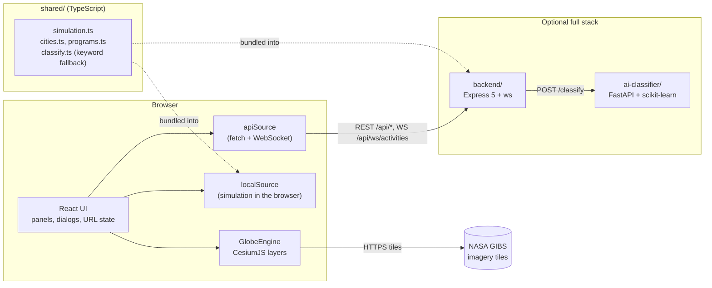

# Architecture

PerAI View draws a 3D globe of **simulated** AI-assistant activity. The design goals were:

1. It must be honest: every number is generated, and the UI says so.
2. It must cost nothing to host: the public demo is a static site.
3. It should still show real full-stack engineering: a hardened API, a WebSocket feed, a small
   machine-learning service, tests at every layer, containers and CI.

The key idea that makes 1-3 compatible is a **shared, deterministic simulation** that runs either
in the browser or behind the API, with identical results.

## Components



| Component | Tech | Responsibility |
| --- | --- | --- |
| `shared/` | Plain TypeScript, no dependencies | City and assistant registries, the simulation, the keyword classifier. Imported by both apps through the `@shared/*` path alias. |
| `frontend/` | React 18, TypeScript, Vite 7, CesiumJS 1.145, Zustand | UI shell, globe rendering, choice of data source |
| `backend/` | Node.js, Express 5, ws, zod, helmet, express-rate-limit | Read-only REST API and WebSocket feed over the simulation; classification proxy |
| `ai-classifier/` | Python, FastAPI, scikit-learn | Prompt to activity-type classifier (TF-IDF + logistic regression) |

## The simulation model (`shared/`)

Nothing here is measured data. The parameters were chosen to look plausible and to be easy to
explain.

**Inputs**

- `cities.ts`: 241 cities in 185 countries. Each has coordinates, an illustrative weight
  from 1 to 100 and the assistant that leads there.
- `programs.ts`: 9 assistants with a relative `share` and an `activityMix` (how their use splits
  across the seven activity types: conversation, writing, coding, image generation,
  summarization, translation and research).

**Time of day.** Each city's local solar hour is `UTC hour + longitude / 15` (no time zones or
daylight saving). Activity follows a normalised daily curve built from three Gaussians (a
morning peak around 10:30, an afternoon peak around 15:00 and a smaller evening bump around
21:00) on top of a night-time floor. A city's intensity right now is
`weight / 100 × curve(local hour)`, so the sunlit side of the planet is always the busiest.

**Aggregates** are pure functions of a timestamp:

- Hourly count for a city: `weight × curve(local hour) × 250`.
- 24-hour totals sum the last 24 hourly samples.
- Each city's activity is split 45% to its leading assistant and 55% across all assistants by
  `share`; each assistant's part is then split by its `activityMix`.
- "People using AI" is derived from activity counts with a fixed ratio.
- A tiny noise factor that is constant within a minute (global stats, ±1.5%) or an hour (trends,
  ±3%) keeps charts from looking synthetic without breaking determinism.

Because these functions only depend on the time, the static demo and the API return the same
analytics for the same instant, and both are easy to unit-test.

**Live events** (`generateActivity`) are random but seedable (mulberry32 PRNG):

1. Pick a city weighted by its current intensity.
2. With 45% probability use the city's leading assistant, otherwise pick one by `share`.
3. Pick an activity type from that assistant's mix and a duration from a per-type range.
4. Jitter the coordinates by up to ±0.2° so repeated events do not stack on one pixel.

The API generates one event every 3 seconds on a single timer. The browser source jitters the
interval between about 1.7 and 4.4 seconds so events do not arrive like a metronome.

## Data flow

The frontend talks to data only through the `DataSource` interface (`frontend/src/data/types.ts`):
global stats, hourly trends, regional stats, per-city intensities, prompt classification and a
live event subscription.

| Mode | Chosen when | Implementation |
| --- | --- | --- |
| `local` | Default for production builds (GitHub Pages, Netlify...) | `localSource.ts` calls the shared functions directly and schedules events with timers |
| `api` | `VITE_DATA_SOURCE=api` or `VITE_API_URL` set at build time (the Docker image) | `apiSource.ts` uses `fetch` with an 8-second timeout and a WebSocket that reconnects with exponential backoff (2 s doubling up to 30 s) |
| `auto` | Default for `npm run dev` | Calls `GET /api/health` once (1.5-second timeout) and picks `api` or `local` |

Refresh cadence: city intensities reload every 60 seconds (the sun moves), the analytics panel
reloads every 60 seconds while open, the city card loads when a city is selected, and live events
are pushed. The store keeps the latest 30 events.

## Frontend

### Structure

- `App.tsx` resolves the data source once, subscribes to live events and renders the shell.
- `store.ts` (Zustand) holds UI state: layer, theme, selected city, panel and dialog visibility,
  rotation, connection state and the event feed. Layer, theme and city are mirrored into the query
  string with `history.replaceState`, which gives shareable deep links such as
  `?layer=heat&theme=cyber&city=Tokyo`.
- `globe/GlobeViewer.tsx` is the only React component that touches the globe. It creates a
  `GlobeEngine` and forwards state changes to it.
- `globe/engine.ts` owns the Cesium `Viewer` and all layers behind a small imperative API
  (`setLayer`, `setTheme`, `setIntensities`, `flash`, `selectCity`, `zoom`, ...). The render loop
  never waits for React re-renders.

### Rendering layers

| Layer | How it is drawn |
| --- | --- |
| Base imagery | NASA GIBS Blue Marble (day) and VIIRS Black Marble 2016 (night lights) as tiled imagery up to zoom level 8. In the **Natural** theme Cesium's sun lighting blends them along the real terminator; the **Cyber** theme hides the day layer, turns off lighting and boosts the night lights. |
| Borders | Natural Earth 1:110m countries from `world-atlas`, meshed with `topojson-client` into one polyline primitive. Loaded as a lazy chunk. |
| Activity (default) | For each city: a vertical beam whose height follows current intensity and whose colour is the leading assistant's map colour, a base point, a cap at the beam top, pulsing rings on up to ten of the busiest cities and labels for the 30 largest cities that fade out when zoomed away. |
| Heat map | A 2048×1024 equirectangular canvas: one additive radial gradient per city (stretched by `1/cos(latitude)` so blobs stay round on the sphere), mapped through a sequential dark-to-light ramp with a lookup table, then draped over the globe as a single imagery tile. New surfaces cross-fade in. The 12 hottest cities get markers and every city has an invisible pick target. |
| Live flashes | Each new event adds an expanding ring and a core point in the assistant's colour for 2.2 seconds (at most 24 at once). |
| Selection | A highlight ring and a camera flight to the selected city. |

Rendering uses Cesium's `requestRenderMode`: frames are drawn only while something animates
(rotation, flashes, pulses, cross-fades) or changes, which keeps idle GPU use low.

### Camera and motion

The initial view centres the currently sunlit longitude and fits the globe to the viewport. The
globe auto-rotates at 1.2°/s west to east. Rotation pauses after any pointer or wheel input (for
7 seconds), while a city is selected, while the tab is hidden, when the user presses pause, and
always when `prefers-reduced-motion` is set. Reduced motion also removes pulses, shows flashes as a fading ring that does
not expand, makes camera flights instant and disables CSS animations.

### Colour

Nine assistants cannot get nine distinguishable map colours, especially for colour-blind
viewers. Only ChatGPT, Gemini and Claude get their own hue (green `#199e70`, blue `#3987e5`,
orange `#d95926`); the other six share a light neutral grey `#b8c0ca`, and the legend says so. The
four colours were validated together against the dark globe surface, checking every pair as OKLab
distance (ΔE × 100) after simulating full-severity colour-vision deficiency (Machado et al. 2009):
the closest pair under protanopia or deuteranopia is ChatGPT and Claude at 9.4, every pair is at
least 20.9 apart for normal vision, and each colour has at least 3:1 contrast. (An earlier, darker
grey `#8f99a6` failed: it sat only 14.3 from ChatGPT for normal vision.) Tritanopia is the weak case:
ChatGPT and Claude drop to about 4. Colour is never the only channel: the city card, live feed and analytics panel name
the assistant in text. The heat map uses a single-hue sequential ramp, which reads correctly without
hue discrimination.

### Resilience

- WebGL is detected before Cesium starts; without it the UI explains the problem and the panels
  still work.
- A lost WebGL context or render error shows a message with a **Restart globe** button that
  remounts the engine.
- After 8 failed imagery tiles the engine adds CesiumJS's bundled low-resolution Natural Earth II
  imagery underneath, so the globe never stays blank.
- A loading overlay is removed after the first tiles arrive, or after 12 seconds at the latest.

### Accessibility

Labelled controls with `aria-pressed` state, a native `<dialog>` for About, Escape to
close panels, an `aria-live` city card, a screen-reader description of the globe, a visually hidden
data table behind the trend chart, `forced-colors` support and 44 px touch targets on phones. The
end-to-end suite runs an axe scan and checks the phone layout for overflow and target sizes.

### Loading performance

`Cesium.js` (about 6 MB, 1.8 MB gzipped) is loaded with `defer`, so the inline splash screen
paints immediately. The globe engine and the border data are separate lazy chunks. Hashed assets
under `/assets/` can be cached indefinitely.

## Backend

```
src/
  index.ts          process entry: config, feed timer, HTTP server, WebSocket, graceful shutdown
  app.ts            createApp(config, deps): middleware and routes, no side effects (used by tests)
  config.ts         zod-validated environment
  routes/           health, programs, activities, analytics, classify
  services/         ActivityFeed (ring buffer + timer), classifier proxy with fallback
  realtime/         WebSocket hub on /api/ws/activities
  middleware/       helmet, CORS, rate limits, request logging, error envelope
```

- **One feed, many consumers.** `ActivityFeed` generates an event every 3 seconds into a 200-slot
  ring buffer and notifies subscribers. The REST endpoint reads the buffer; the WebSocket hub
  broadcasts each event to all clients. The cost of generating events does not grow with the
  number of clients.
- **Stateless analytics.** Analytics endpoints call the shared pure functions with the current
  time, so several backend instances would agree without shared storage (each would have its own
  live-event buffer).
- **Graceful shutdown.** On `SIGINT`/`SIGTERM` the feed stops, WebSocket clients are closed with
  code 1001, the HTTP server drains, and the process is forced to exit after 10 seconds.
- **Logging.** One JSON line per request with method, path, status and duration. Query strings,
  bodies and prompt text are never logged. Health checks are not logged.

## Classifier

A deliberately small, reproducible model: word 1-2-gram and character 3-5-gram TF-IDF features
into multinomial logistic regression, trained at startup on 350 hand-written synthetic prompts
(50 per label). Five-fold stratified cross-validation runs once at startup and reports about 0.85
accuracy through `GET /model-info`. The model version is derived from a hash of the training data.
See [`ai-classifier/README.md`](../ai-classifier/README.md) for its limitations.

The activity types of simulated events come from the simulation, not from the classifier. The
classifier is used by the **Try the activity classifier** box in the About dialog, through the
`DataSource`: in API mode it calls `POST /api/classify`, where the backend forwards the text to the
Python service, validates its answer and falls back to the keyword classifier in
`shared/classify.ts` if the service is missing, slow or misbehaving. The static demo has no server,
so it runs that keyword classifier in the browser. Responses always state which one answered, and
the UI shows it.

## Security model

The public surface is small: no accounts, no database, no secrets and no real user data. The
remaining risks are abuse of the API, cross-site issues in the browser and supply-chain problems.

| Area | Measures |
| --- | --- |
| Input | zod validation of every query and body; 16 KB JSON body limit; 2000-character prompt limit; JSON error envelope |
| Abuse | Per-IP rate limits (general and a stricter one for classification); `TRUST_PROXY` so limits see the real client behind a proxy; HTTP header and request timeouts against slow clients |
| Browser access | One origin allow-list used by both CORS and the WebSocket upgrade check; only `GET`, `HEAD`, `POST` and the `Content-Type` header allowed |
| WebSocket | Origin check, a total client cap and a per-IP cap before the handshake; 1 KB inbound frame limit; heartbeat that drops dead clients; slow consumers dropped at 256 KB of backlog |
| Responses | helmet with `default-src 'none'` for the JSON API; no `X-Powered-By`; stack traces only in development with an explicit opt-in |
| Outbound calls | The classifier call has a timeout, refuses redirects, caps response size and validates the response schema |
| Static site (nginx image) | Content Security Policy limited to the site's own origin plus NASA GIBS, `frame-ancestors 'none'`, `nosniff`, a strict referrer policy and a restrictive `Permissions-Policy`. CesiumJS's prebuilt bundle needs `'unsafe-eval'` (Knockout and Emscripten glue) and `blob:` workers; this was verified against a production build. |
| Containers | The web image uses unprivileged nginx (non-root, port 8080), the backend runs as the `node` user and the classifier as an unprivileged user; the backend binds to `127.0.0.1` unless `HOST` says otherwise (the image sets `0.0.0.0`); only the web port is published on all interfaces in Docker Compose, the API and classifier ports are bound to localhost |
| Supply chain | Lockfiles with `npm ci`; pinned Python requirements; `npm audit` and `pip-audit` clean at the time of writing; Dependabot for npm, pip, Docker and GitHub Actions; CI workflows with read-only permissions and no persisted checkout credentials |

## Trade-offs

| Decision | Benefit | Cost |
| --- | --- | --- |
| Simulated data | Honest, no privacy questions, no data pipeline | The map shows a model, not reality; weights and shares are illustrative |
| Run the simulation in the browser for the demo | Free static hosting, no server to keep awake | The demo does not exercise the backend; the full stack needs Docker or a server |
| In-memory state, no database | Nothing to provision or secure | Restarting the API resets the live feed buffer; history beyond 200 events is not kept |
| CesiumJS | Real 3D globe with tiled imagery streaming, sun lighting and picking | Large download and a CSP that must allow `'unsafe-eval'` |
| NASA GIBS imagery | Public domain, no API key, no cost | Depends on an external service; mitigated by the bundled fallback imagery |
| Solar time from longitude | Simple and deterministic | Ignores time zones and daylight saving |
| Separate Python classifier | Real ML service with its own tests and evaluation | A second runtime; the backend's keyword fallback keeps the API usable without it |
