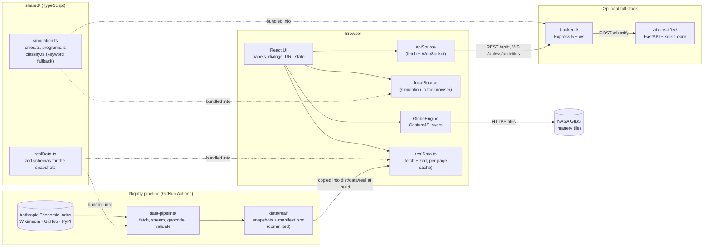

# Architecture

PerAI View draws a 3D globe of AI-assistant use from two kinds of data: a **simulation** of live
activity and **real published datasets** about where and how assistants are used. The design
goals were:

1. It must be honest: every number says whether it is generated or measured, and measured
   numbers name their publisher, date and licence. The two are never blended.
2. It must cost nothing to host: the public demo is a static site, and every data source is free.
3. It should still show real full-stack engineering: a hardened API, a WebSocket feed, a small
   machine-learning service, a data pipeline, tests at every layer, containers and CI.

Two ideas make 1-3 compatible. A **shared, deterministic simulation** runs either in the browser
or behind the API with identical results. And real data arrives as **committed, schema-validated
snapshots**: a nightly pipeline writes JSON files that the static site ships as-is, so the browser
never depends on a third-party API being up.

## Components



| Component | Tech | Responsibility |
| --- | --- | --- |
| `shared/` | Plain TypeScript; zod for `realData.ts` | City and assistant registries, the simulation, the keyword classifier, and the schemas of the real-data snapshots. Imported by the frontend, the backend and the pipeline through the `@shared/*` path alias. |
| `data-pipeline/` | Node.js 22, TypeScript (tsx), zod, google-auth-library, world-countries | Fetches five public sources, geocodes and aggregates them, validates the result and writes `data/real/`; runs nightly in GitHub Actions and commits the changes |
| `data/real/` | JSON | The committed snapshots plus `manifest.json` (status, dates, licence and caveats per source); served by the site as static files |
| `frontend/` | React 18, TypeScript, Vite 7, CesiumJS 1.145, Zustand, zod | UI shell, globe rendering (simulated beams and heat map, real choropleths and city points), choice of data source, snapshot loading and validation |
| `backend/` | Node.js, Express 5, ws, zod, helmet, express-rate-limit | Read-only REST API and WebSocket feed over the simulation; classification proxy |
| `ai-classifier/` | Python, FastAPI, scikit-learn | Prompt to activity-type classifier (TF-IDF + logistic regression) |

## The simulation model (`shared/`)

Nothing here is measured data. The parameters were chosen to look plausible and to be easy to
explain.

**Inputs**

- `cities.ts`: 241 cities in 185 countries. Each has coordinates, an illustrative weight
  from 1 to 100 and the assistant that leads there.
- `programs.ts`: 9 assistants with a relative `share` and an `activityMix` (how their use splits
  across the seven activity types: conversation, writing, coding, image generation,
  summarization, translation and research).

**Time of day.** Each city's local solar hour is `UTC hour + longitude / 15` (no time zones or
daylight saving). Activity follows a normalised daily curve built from three Gaussians (a
morning peak around 10:30, an afternoon peak around 15:00 and a smaller evening bump around
21:00) on top of a night-time floor. A city's intensity right now is
`weight / 100 × curve(local hour)`, so the sunlit side of the planet is always the busiest.

**Aggregates** are pure functions of a timestamp:

- Hourly count for a city: `weight × curve(local hour) × 250`.
- 24-hour totals sum the last 24 hourly samples.
- Each city's activity is split 45% to its leading assistant and 55% across all assistants by
  `share`; each assistant's part is then split by its `activityMix`.
- "People using AI" is derived from activity counts with a fixed ratio.
- A tiny noise factor that is constant within a minute (global stats, ±1.5%) or an hour (trends,
  ±3%) keeps charts from looking synthetic without breaking determinism.

Because these functions only depend on the time, the static demo and the API return the same
analytics for the same instant, and both are easy to unit-test.

**Live events** (`generateActivity`) are random but seedable (mulberry32 PRNG):

1. Pick a city weighted by its current intensity.
2. With 45% probability use the city's leading assistant, otherwise pick one by `share`.
3. Pick an activity type from that assistant's mix and a duration from a per-type range.
4. Jitter the coordinates by up to ±0.2° so repeated events do not stack on one pixel.

The API generates one event every 3 seconds on a single timer. The browser source jitters the
interval between about 1.7 and 4.4 seconds so events do not arrive like a metronome.

## Real data

Everything in this section is measured by a third party and published under a free licence;
the pipeline stores aggregated counts only, never anything about a person. The file-level
reference (what each snapshot contains, licences, caveats, how to run the pipeline) is
[`data/real/README.md`](../data/real/README.md); this section covers the design.

### Sources

| Source | Snapshot | What the pipeline does with it |
| --- | --- | --- |
| Anthropic Economic Index (Hugging Face) | `ai-usage-by-country.json`, the Claude series in `activity-types.json` | Lists the dataset through the Hugging Face API, picks the newest `release_*/data/aei_claude_ai_*.csv`, and extracts per-country and per-US-state `usage_pct` and `usage_per_capita_index` for the latest month plus the global request-topic mix (121 countries and 52 states in the May 2026 release). New releases appear roughly quarterly; the entry goes `stale` after 120 days |
| *How People Use ChatGPT* (NBER WP 34255) | the ChatGPT series in `activity-types.json` | No dataset was published, so the six topic shares for July 2025 (and July 2024 for comparison) are transcribed in `sources/openai.ts` with the quoted sentence as a note on each; the series is static and never goes stale |
| Wikimedia pageviews | `wikipedia-interest.json` | Resolves each assistant's article in every language edition through Wikidata sitelinks (8 articles, 436 editions), sums daily human views over the last 30 full days through the Pageviews REST API, and adds per-country sums from the differentially private `country_project_page` dataset, which only publishes cells above a privacy threshold and is therefore a lower bound (about 75 countries); `stale` after 45 days |
| GitHub fork owners | `developer-cities.json` | Pages through the newest 6,000 forks of 8 official SDK repositories with the GraphQL API, keeps only the free-text `location` of user (not organisation) owners, and geocodes it offline to the globe's 241 cities or to a country. 42% of locations resolve to a city and 88% to a country; 159 cities in the current snapshot; `stale` after 45 days |
| PyPI downloads (BigQuery) | `sdk-downloads-by-country.json` | Runs one query over `bigquery-public-data.pypi.file_downloads` for the `openai`, `anthropic`, `google-genai` and `mistralai` packages, grouped by country, over the last 7 complete days. Optional: without `BIGQUERY_PROJECT` and credentials it writes `status: "not_configured"` and the UI disables the layer |
| `world-countries` npm package | `countries.json` | Rebuilt offline on every run: alpha-2, name, ISO numeric `ccn3` (the key that matches world-atlas feature ids) and a centroid for every country |

Assistant ids are the `ProgramId`s from `shared/programs.ts`, so colours and names are consistent
with the simulation. Where a source describes a vendor rather than a product (an SDK, a company
article), the UI shows the vendor label rather than "ChatGPT usage".

### Pipeline design (`data-pipeline/`)

```
src/
  refresh.ts        CLI and orchestrator: --only, --skip, --force, --data-dir
  validate.ts       parses every snapshot against the shared schemas (CI and the workflow run it)
  manifest.ts       status rules: ok / stale / failed / not_configured, "kept" when a source is skipped
  sources/          one fetcher per source, each returning { file, data, series?, as_of, notes }
  lib/http.ts       fetch with timeout, retries with backoff, Retry-After, fixed User-Agent
  lib/lines.ts      byte stream to lines without buffering (a 219 MB CSV costs kilobytes)
  lib/csv.ts        RFC 4180 records over that line stream
  lib/geocode.ts    offline geocoder: normalised text against city aliases, countries, states, flags
  lib/state.ts      .pipeline-state.json: per-source cache slices, each behind its own zod schema
```

- **Sources are independent.** The orchestrator runs each fetcher in turn inside its own
  try/catch. A failure keeps the previous snapshot file and the manifest entry becomes `failed`
  with the error message; a source excluded with `--only`/`--skip` is `kept` untouched. The
  process exits 1 only when a produced file fails schema validation or when no source succeeded,
  so one flaky API never blocks the others from publishing.
- **Streaming, not buffering.** The Anthropic CSV is read from the HTTP body line by line and
  aggregated on the fly; the Wikimedia country files (TSV, one per day) are handled the same way.
  Memory stays flat regardless of file size.
- **Caches by content, not by time.** The Anthropic fetcher compares the newest CSV's Hugging
  Face object id (from the dataset's file listing) with the cached fingerprint and reuses the
  previous extraction when it matches, so the 219 MB file is streamed once per release. The
  Wikipedia fetcher caches per-day country sums and downloads only the days missing from the
  30-day window, dropping days that fell out of it. `--force` ignores both. The cache lives in
  `data/real/.pipeline-state.json`, which is git-ignored and kept in the GitHub Actions cache;
  each source reads its slice through a zod schema, so a corrupt or outdated entry is rebuilt
  rather than crashing the run.
- **Offline geocoding.** Free-text GitHub locations ("Bengaluru, India", "SF Bay Area",
  "Berlin/London", "Remote") are normalised (diacritics removed, punctuation collapsed) and
  matched against the globe's cities plus an alias table, then against country names, ISO codes,
  flag emoji, US states, provinces and well-known cities that are not on the globe. There is no
  fuzzy matching and no external geocoder: the match rate is reported in the snapshot
  (`geocoding.matched_city_pct`, `matched_country_pct`) rather than inflated.
- **Validation at the boundary.** Every fetcher's output is parsed with the schema from
  `shared/realData.ts` before it is written; the write itself is atomic (temp file and rename).
  `npm run validate` re-parses the whole directory, and CI runs it on every pull request so a
  hand-edited or half-written snapshot cannot reach `main`.
- **Provenance is data.** Each source declares its title, publisher, URL, licence and
  description once (`meta` in its fetcher); the orchestrator adds status, `fetched_at`, `as_of`,
  the error if any, and per-run notes (release name, object id, days covered, match rates) to
  `manifest.json`. The UI reads that file rather than hard-coding any of it.
- **Freshness.** Each source has a `staleAfterDays` (45 for the rolling windows, 120 for the
  quarterly Anthropic releases, none for the static transcription). The status becomes `stale`
  when the last successful freshness date is older than that, so a source that keeps failing
  quietly is visible in the layer menu and the About dialog.

The nightly workflow (`.github/workflows/refresh-data.yml`, 04:15 UTC) restores the cache,
runs the refresh (PyPI only on Mondays or when dispatched with `force_pypi`, because the query
scans tens of GB of the free 1 TB monthly quota), validates, and commits `data/real/**` as
`github-actions[bot]` when anything changed. See [DEPLOYMENT.md](DEPLOYMENT.md#real-data-snapshots-and-the-nightly-refresh).

### Frontend

- **Loader.** `data/realData.ts` fetches `./data/real/<file>.json` relative to the site's base
  URL with a 15-second timeout, parses it with the same zod schema the pipeline used, and caches
  the promise for the page's lifetime (the files change at most daily). A validation failure is
  surfaced as an error with the offending path rather than retried. `useRealData(key, enabled)`
  wraps it for components. In development Vite serves `../data/real` directly; at build time the
  `perai:real-data` plugin copies the `.json` files into `dist/data/real`.
- **Layer registry.** `layers.ts` lists every map layer with its `kind` (`simulated` or `real`),
  `geometry` (`points` or `countries`), the snapshot it needs and the manifest source that
  describes it. The layer menu groups layers by kind and reads the manifest to disable a real
  layer whose source is `not_configured` or has never succeeded, and to show the "as of" date or
  `stale` next to the others. `data/layerData.ts` turns each snapshot into what the engine draws.
- **Choropleths.** Real country layers colour the Natural Earth 1:110m polygons that already
  provide the borders. `countries.json` maps ISO numeric ids (`ccn3`, which is what world-atlas
  uses as feature ids) to alpha-2 codes, so a snapshot keyed by `cc` can be joined to geometry
  without a lookup table in the frontend. Each polygon becomes a `GeometryInstance` with a
  per-instance colour, drawn slightly above the surface, with Antarctica skipped. Countries
  without data get a faint neutral fill so absence is visible rather than black.
- **Scaling.** `globe/choropleth.ts` maps values to 0-1 with `normaliseValues`: skewed counts
  (usage shares, pageviews, downloads) use a square-root scale so a few dominant countries do not
  wash everything else out, while ratios such as the per-capita usage index use a linear scale
  clipped at the 97th percentile. The colour ramp is a single hue (teal to white), readable
  without hue discrimination and distinct from the amber simulated heat map; the legend shows
  the same gradient with the layer's metric.
- **Picking and selection.** Each choropleth instance carries a `{ kind: 'country', name: cc }`
  id, so the same `scene.pick` handler that selects cities selects countries. Selecting a country
  draws an outline primitive above the fill, flies the camera there, opens the country card (one
  row per source that covers the country) and mirrors the selection into the URL as
  `?country=DE`. City and country selection are mutually exclusive in the store.
- **Provenance chip.** The top-bar status chip switches from "Simulated data · Live" to
  "Real data · <publisher> · <as of>" whenever a real layer is active, and opens the About
  dialog's *Real data sources* list, which is rendered from `manifest.json`. The legend repeats
  the publisher and date under the gradient, and every block in the analytics panel's *Real
  data* tab ends with a source line (title, date, licence) linking to the dataset.
- **Vendor labels.** For sources about SDKs or companies the components show the vendor
  (`getProgram(id).vendor`), for example "Anthropic SDKs lead", instead of the product name.

## Data flow

The frontend talks to data only through the `DataSource` interface (`frontend/src/data/types.ts`):
global stats, hourly trends, regional stats, per-city intensities, prompt classification and a
live event subscription.

| Mode | Chosen when | Implementation |
| --- | --- | --- |
| `local` | Default for production builds (GitHub Pages, Netlify...) | `localSource.ts` calls the shared functions directly and schedules events with timers |
| `api` | `VITE_DATA_SOURCE=api` or `VITE_API_URL` set at build time (the Docker image) | `apiSource.ts` uses `fetch` with an 8-second timeout and a WebSocket that reconnects with exponential backoff (2 s doubling up to 30 s) |
| `auto` | Default for `npm run dev` | Calls `GET /api/health` once (1.5-second timeout) and picks `api` or `local` |

Refresh cadence: city intensities reload every 60 seconds (the sun moves), the analytics panel
reloads every 60 seconds while open, the city card loads when a city is selected, and live events
are pushed. The store keeps the latest 30 events.

Real data does not go through `DataSource`: it is static and identical in every mode. Components
call `useRealData(key)` from `data/realData.ts`, which fetches the snapshot from `./data/real/`,
validates it and caches it for the page's lifetime. The manifest is loaded on first use by the
layer menu, the status chip and the About dialog; the other files load when a real layer, the
*Real data* tab or the country card needs them. Switching to a real layer with a `?layer=` deep
link therefore works in the static demo, the Docker build and the split deployment alike.

## Frontend

### Structure

- `App.tsx` resolves the data source once, subscribes to live events and renders the shell.
- `store.ts` (Zustand) holds UI state: layer, theme, selected city or country, panel and dialog
  visibility, rotation, connection state and the event feed. Layer, theme, city and country are
  mirrored into the query string with `history.replaceState`, which gives shareable deep links
  such as `?layer=heat&theme=cyber&city=Tokyo` or `?layer=usage-index&country=DE`.
- `layers.ts` is the registry of map layers (two simulated, four real) and the only place that
  says which snapshot and manifest source a layer depends on.
- `data/realData.ts` loads and validates the snapshots; `data/layerData.ts` adapts each one to
  the engine's inputs (country values with a scaling mode, or city points).
- `globe/GlobeViewer.tsx` is the only React component that touches the globe. It creates a
  `GlobeEngine` and forwards state changes to it.
- `globe/engine.ts` owns the Cesium `Viewer` and all layers behind a small imperative API
  (`setLayer`, `setTheme`, `setIntensities`, `flash`, `selectCity`, `zoom`, ...). The render loop
  never waits for React re-renders.

### Rendering layers

| Layer | How it is drawn |
| --- | --- |
| Base imagery | NASA GIBS Blue Marble (day) and VIIRS Black Marble 2016 (night lights) as tiled imagery up to zoom level 8. In the **Natural** theme Cesium's sun lighting blends them along the real terminator; the **Cyber** theme hides the day layer, turns off lighting and boosts the night lights. |
| Borders | Natural Earth 1:110m countries from `world-atlas`, meshed with `topojson-client` into one polyline primitive. Loaded as a lazy chunk. |
| Activity (default) | For each city: a vertical beam whose height follows current intensity and whose colour is the leading assistant's map colour, a base point, a cap at the beam top, pulsing rings on up to ten of the busiest cities and labels for the 30 largest cities that fade out when zoomed away. |
| Heat map | A 2048×1024 equirectangular canvas: one additive radial gradient per city (stretched by `1/cos(latitude)` so blobs stay round on the sphere), mapped through a sequential dark-to-light ramp with a lookup table, then draped over the globe as a single imagery tile. New surfaces cross-fade in. The 12 hottest cities get markers and every city has an invisible pick target. |
| Live flashes | Each new event adds an expanding ring and a core point in the assistant's colour for 2.2 seconds (at most 24 at once). |
| Country choropleths (real) | *Claude usage by country*, *Wikipedia interest by country* and *SDK downloads by country* fill the Natural Earth polygons with a single-hue teal ramp from `globe/choropleth.ts`, one `GeometryInstance` per polygon keyed by alpha-2 code, slightly above the surface; countries without data get a faint neutral fill. Antarctica is skipped. |
| Developers by city (real) | Reuses the beam renderer with counts from `developer-cities.json` instead of simulated intensities; the colour is the leading vendor's. |
| Selection | A highlight ring and a camera flight to the selected city, or an outline primitive above the fill and a flight to the selected country. |

Rendering uses Cesium's `requestRenderMode`: frames are drawn only while something animates
(rotation, flashes, pulses, cross-fades) or changes, which keeps idle GPU use low.

### Camera and motion

The initial view centres the currently sunlit longitude and fits the globe to the viewport. The
globe auto-rotates at 1.2°/s west to east. Rotation pauses after any pointer or wheel input (for
7 seconds), while a city is selected, while the tab is hidden, when the user presses pause, and
always when `prefers-reduced-motion` is set. Reduced motion also removes pulses, shows flashes as a fading ring that does
not expand, makes camera flights instant and disables CSS animations.

### Colour

Nine assistants cannot get nine distinguishable map colours, especially for colour-blind
viewers. Only ChatGPT, Gemini and Claude get their own hue (green `#199e70`, blue `#3987e5`,
orange `#d95926`); the other six share a light neutral grey `#b8c0ca`, and the legend says so. The
four colours were validated together against the dark globe surface, checking every pair as OKLab
distance (ΔE × 100) after simulating full-severity colour-vision deficiency (Machado et al. 2009):
the closest pair under protanopia or deuteranopia is ChatGPT and Claude at 9.4, every pair is at
least 20.9 apart for normal vision, and each colour has at least 3:1 contrast. (An earlier, darker
grey `#8f99a6` failed: it sat only 14.3 from ChatGPT for normal vision.) Tritanopia is the weak case:
ChatGPT and Claude drop to about 4. Colour is never the only channel: the city card, live feed and analytics panel name
the assistant in text. The heat map uses a single-hue sequential ramp, which reads correctly without
hue discrimination.

### Resilience

- WebGL is detected before Cesium starts; without it the UI explains the problem and the panels
  still work.
- A lost WebGL context or render error shows a message with a **Restart globe** button that
  remounts the engine.
- After 8 failed imagery tiles the engine adds CesiumJS's bundled low-resolution Natural Earth II
  imagery underneath, so the globe never stays blank.
- A loading overlay is removed after the first tiles arrive, or after 12 seconds at the latest.

### Accessibility

Labelled controls with `aria-pressed` state, a native `<dialog>` for About, Escape to
close panels, an `aria-live` city card, a screen-reader description of the globe, a visually hidden
data table behind the trend chart, `forced-colors` support and 44 px touch targets on phones. The
end-to-end suite runs an axe scan and checks the phone layout for overflow and target sizes.

### Loading performance

`Cesium.js` (about 6 MB, 1.8 MB gzipped) is loaded with `defer`, so the inline splash screen
paints immediately. The globe engine and the border data are separate lazy chunks. Hashed assets
under `/assets/` can be cached indefinitely.

## Backend

```
src/
  index.ts          process entry: config, feed timer, HTTP server, WebSocket, graceful shutdown
  app.ts            createApp(config, deps): middleware and routes, no side effects (used by tests)
  config.ts         zod-validated environment
  routes/           health, programs, activities, analytics, classify
  services/         ActivityFeed (ring buffer + timer), classifier proxy with fallback
  realtime/         WebSocket hub on /api/ws/activities
  middleware/       helmet, CORS, rate limits, request logging, error envelope
```

- **One feed, many consumers.** `ActivityFeed` generates an event every 3 seconds into a 200-slot
  ring buffer and notifies subscribers. The REST endpoint reads the buffer; the WebSocket hub
  broadcasts each event to all clients. The cost of generating events does not grow with the
  number of clients.
- **Stateless analytics.** Analytics endpoints call the shared pure functions with the current
  time, so several backend instances would agree without shared storage (each would have its own
  live-event buffer).
- **Graceful shutdown.** On `SIGINT`/`SIGTERM` the feed stops, WebSocket clients are closed with
  code 1001, the HTTP server drains, and the process is forced to exit after 10 seconds.
- **Logging.** One JSON line per request with method, path, status and duration. Query strings,
  bodies and prompt text are never logged. Health checks are not logged.

## Classifier

A deliberately small, reproducible model: word 1-2-gram and character 3-5-gram TF-IDF features
into multinomial logistic regression, trained at startup on 350 hand-written synthetic prompts
(50 per label). Five-fold stratified cross-validation runs once at startup and reports about 0.85
accuracy through `GET /model-info`. The model version is derived from a hash of the training data.
See [`ai-classifier/README.md`](../ai-classifier/README.md) for its limitations.

The activity types of simulated events come from the simulation, not from the classifier. The
classifier is used by the **Try the activity classifier** box in the About dialog, through the
`DataSource`: in API mode it calls `POST /api/classify`, where the backend forwards the text to the
Python service, validates its answer and falls back to the keyword classifier in
`shared/classify.ts` if the service is missing, slow or misbehaving. The static demo has no server,
so it runs that keyword classifier in the browser. Responses always state which one answered, and
the UI shows it.

## Security model

The public surface is small: no accounts, no database and no per-person data. The only secrets
are the optional BigQuery credentials the nightly refresh workflow reads. The remaining risks are
abuse of the API, cross-site issues in the browser, the integrity of the committed snapshots and
supply-chain problems.

| Area | Measures |
| --- | --- |
| Input | zod validation of every query and body; 16 KB JSON body limit; 2000-character prompt limit; JSON error envelope |
| Abuse | Per-IP rate limits (general and a stricter one for classification); `TRUST_PROXY` so limits see the real client behind a proxy; HTTP header and request timeouts against slow clients |
| Browser access | One origin allow-list used by both CORS and the WebSocket upgrade check; only `GET`, `HEAD`, `POST` and the `Content-Type` header allowed |
| WebSocket | Origin check, a total client cap and a per-IP cap before the handshake; 1 KB inbound frame limit; heartbeat that drops dead clients; slow consumers dropped at 256 KB of backlog |
| Responses | helmet with `default-src 'none'` for the JSON API; no `X-Powered-By`; stack traces only in development with an explicit opt-in |
| Outbound calls | The classifier call has a timeout, refuses redirects, caps response size and validates the response schema |
| Static site (nginx image) | Content Security Policy limited to the site's own origin plus NASA GIBS, `frame-ancestors 'none'`, `nosniff`, a strict referrer policy and a restrictive `Permissions-Policy`. CesiumJS's prebuilt bundle needs `'unsafe-eval'` (Knockout and Emscripten glue) and `blob:` workers; this was verified against a production build. |
| Containers | The web image uses unprivileged nginx (non-root, port 8080), the backend runs as the `node` user and the classifier as an unprivileged user; the backend binds to `127.0.0.1` unless `HOST` says otherwise (the image sets `0.0.0.0`); only the web port is published on all interfaces in Docker Compose, the API and classifier ports are bound to localhost |
| Real-data snapshots | Written only by the pipeline and validated three times (before writing, in CI, in the browser); the browser fetches them from the site's own origin, never from Hugging Face, Wikimedia or GitHub; the pipeline uses timeouts, bounded retries with backoff that honour `Retry-After`, a fixed `User-Agent`, and stores aggregated counts only |
| Refresh workflow | The one workflow with `contents: write`; it runs on a schedule and on manual dispatch only, never on pull requests, so untrusted code cannot reach the write token; BigQuery credentials are repository secrets read by that job alone |
| Supply chain | Lockfiles with `npm ci`; pinned Python requirements; `npm audit` and `pip-audit` clean at the time of writing; Dependabot for npm (root, frontend, backend, data-pipeline), pip, Docker and GitHub Actions; CI workflows with read-only permissions and no persisted checkout credentials |

## Trade-offs

| Decision | Benefit | Cost |
| --- | --- | --- |
| Simulated live activity | Honest, no privacy questions, always something moving on the globe | The activity and heat-map layers show a model, not reality; weights and shares are illustrative |
| Real data as committed snapshots | Reproducible builds, no runtime dependency on third-party APIs, provenance in git history, free hosting | Data is at most a day old; every refresh is a bot commit in the history; the repository grows slowly |
| Published aggregates only | Free licences, no per-person data, nothing to secure | Coverage is uneven (Anthropic publishes about 120 countries, Wikimedia's country data is a lower bound, GitHub locations are self-reported and 42% match a city); the UI says so rather than filling gaps |
| Transcribing the ChatGPT paper | The only published figures on ChatGPT topic mix | Six numbers copied by hand from a paper; labelled as a transcription and never refreshed |
| Run the simulation in the browser for the demo | Free static hosting, no server to keep awake | The demo does not exercise the backend; the full stack needs Docker or a server |
| In-memory state, no database | Nothing to provision or secure | Restarting the API resets the live feed buffer; history beyond 200 events is not kept |
| CesiumJS | Real 3D globe with tiled imagery streaming, sun lighting and picking | Large download and a CSP that must allow `'unsafe-eval'` |
| NASA GIBS imagery | Public domain, no API key, no cost | Depends on an external service; mitigated by the bundled fallback imagery |
| Solar time from longitude | Simple and deterministic | Ignores time zones and daylight saving |
| Separate Python classifier | Real ML service with its own tests and evaluation | A second runtime; the backend's keyword fallback keeps the API usable without it |
